### Задача 1

 - https://hub.docker.com/repository/docker/nevers0nn/custom-nginx/general

### Задача 2
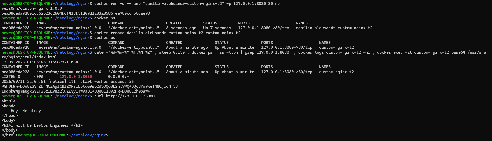

### Задача 3

- Контейнер завершился, потому что docker attach подключается в главному процессу в контейнере, а CTRL + C отправил сигнал прерывания, т.к. nginx это главный процессор, то соответственно завершился сам контейнер

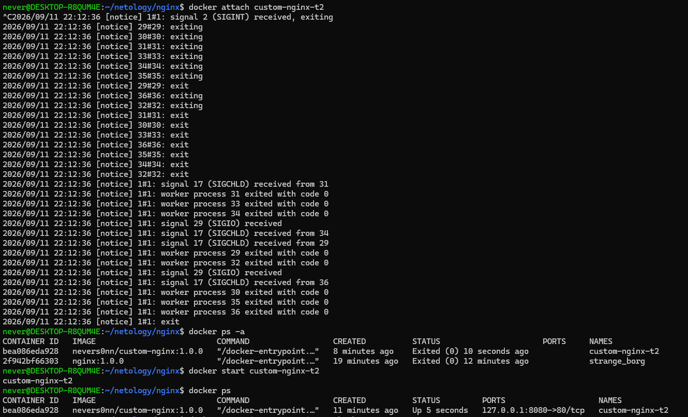
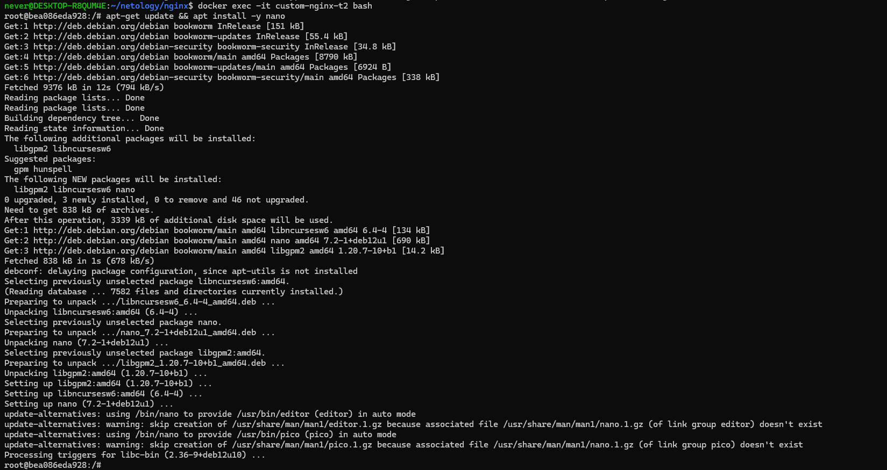
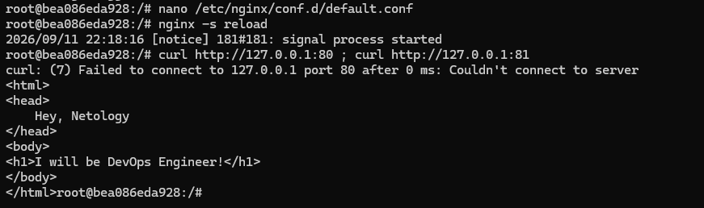
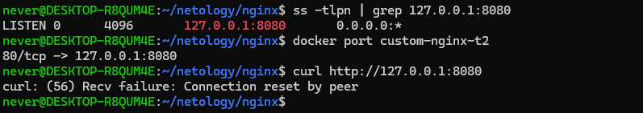

- При запуске контейнера, мы указали что порт 8080 перенапрявляется на 80 порт контейнера. После смены конфигов, мы указали, что nginx будет работать на 81 порту, а докер продолжает слать трафик на 80 порт.

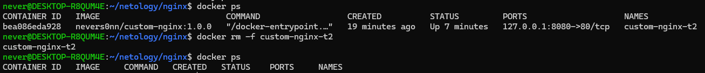

### Задача 4

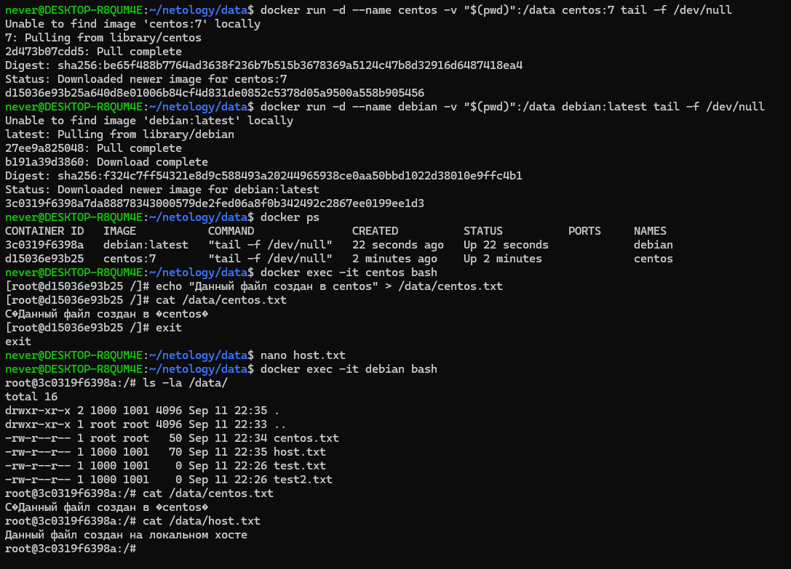

### Задача 5

- Потому что, по дефолту docker-compose выбирает compose.yaml

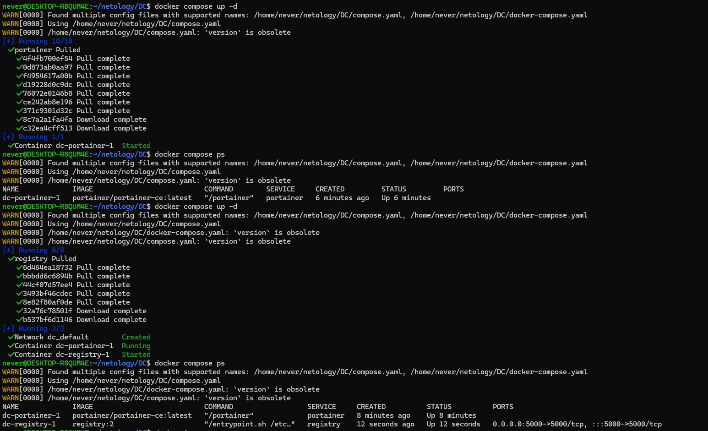
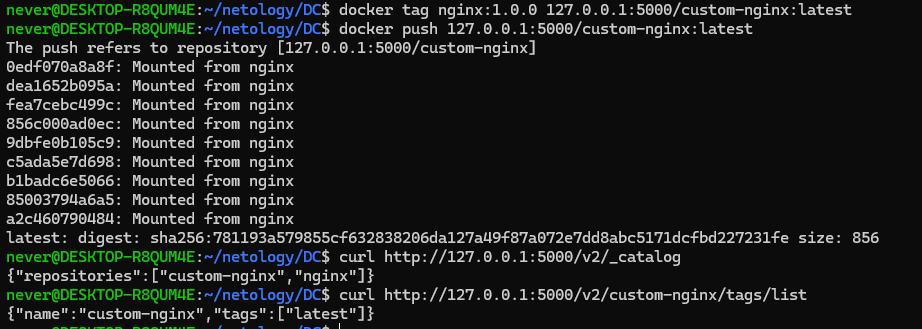
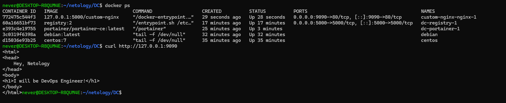
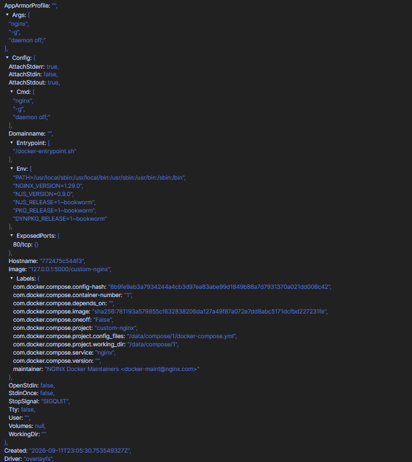
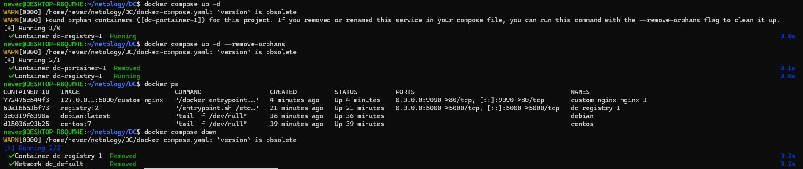
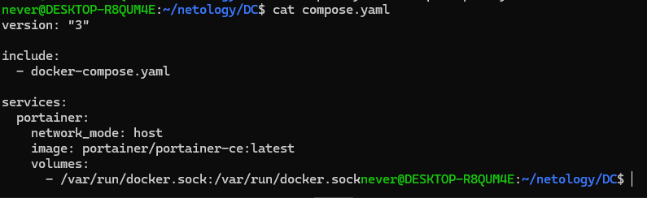

-Compose обнаружил контейнер, который относится к этому же проекту, но больше не описан в текущем compose-файле. Такой контейнер называется orphan container. В нашем случае Portainer был создан предыдущей конфигурацией, но после удаления compose.yaml сервис portainer исчез из текущего описания проекта.